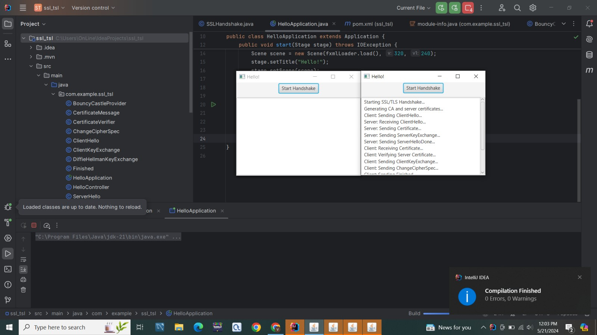

# SSL/TLS Handshake Simulation
Universiteti i Prishtinës 'Hasan Prishtina' 

Fakulteti i Inxhinierisë Elektrike dhe Kompjuterike
Departamenti: Inxhinieri Kompjuterike dhe Softuerike
Projekti i tretë nga lënda e 'Siguria e të dhënave' nën udhëheqjen e Ass. Arbena Musa

# Kontribuesit
Taulan Shala

Vesa Grainca

Venesa Fejza

# Historia:
SSL/TLS (Secure Sockets Layer/Transport Layer Security) është një protokoll sigurie i përdorur për të siguruar komunikimin në internet midis klientëve dhe serverëve. Ky protokoll siguron konfidencialitetin, integritetin dhe autentifikimin e të dhënave të dërguara. Procesi i dorëzimit të një lidhjeje të sigurtë quhet "handshake" (shtrëngim duarsh). Kjo është një përmbledhje e shkurtër e historisë dhe evolucionit të këtij protokolli:

# Teknologjitë e Përdorura:
Gjuhë Programimi: Java, JavaFX
Biblioteka të jashtme: Bouncy Castle

# Përshkrimi i File-ve Kryesore:

# BouncyCastleProvider.java
Kjo klasë zgjeron klasën Provider nga API-ja e Sigurisë së Java për të regjistruar ofruesin Bouncy Castle për operacionet kriptografike. Bouncy Castle është një bibliotekë e fuqishme që ofron shumë algoritme të ndryshëm kriptografikë. Kjo klasë është përdorur për të shtuar Bouncy Castle si një ofrues i sigurisë në aplikacionin tonë.

# CertificateMessage.java
Kjo klasë menaxhon krijimin dhe kodimin e certifikatave X509. Ajo mban një objekt të tipit X509Certificate dhe ofron një metodë për ta konvertuar atë në një varg bajtësh (byte[]). Kjo është e nevojshme për të transmetuar certifikatën përmes rrjetit gjatë handshake SSL/TLS.

# CertificateVerifier.java
Kjo klasë verifikon certifikatën e serverit kundër një liste të CA-ve (Authority Certifikata) të besuara. Ajo merr një listë të certifikatave të besuara në konstruktor dhe ofron një metodë verify që kontrollon nëse certifikata e serverit është lëshuar nga një CA e besuar dhe nëse është e vlefshme.

# ChangeCipherSpec.java
Kjo klasë përfaqëson mesazhin Change Cipher Spec në handshake SSL/TLS, i cili sinjalizon ndryshimin në komunikim të koduar. Ajo përmban një metodë toByteArray që kthen një varg bajtësh që përfaqëson mesazhin.

# ClientHello.java
Kjo klasë gjeneron mesazhin ClientHello, i cili është mesazhi i parë që dërgohet nga klienti për të inicuar handshake SSL/TLS. Ajo përmban një varg të rastësishëm bajtësh (random) dhe një listë të suitat e kodimit (cipherSuites) të mbështetura. Metoda toByteArray e konverton këtë mesazh në një varg bajtësh për transmetim.

# ClientKeyExchange.java
Kjo klasë menaxhon mesazhin ClientKeyExchange, i cili përmban sekretin paraprak (preMasterSecret) të përdorur në shkëmbimin e çelësave. Ajo ofron një metodë toByteArray që kthen sekretin paraprak në një varg bajtësh për transmetim.

# DiffieHellmanKeyExchange.java
Kjo klasë implementon shkëmbimin e çelësave Diffie-Hellman për të gjeneruar një sekret të përbashkët. Ajo krijon një palë çelësa (keyPair) dhe inicializon një marrëveshje çelësi (keyAgreement). Metodat e saj lejojnë marrjen e çelësit publik (getPublicKey), pranimin e çelësit publik të palës tjetër (receivePublicKey), dhe gjenerimin e sekretit të përbashkët (generateSharedSecret).

# Finished.java
Kjo klasë përfaqëson mesazhin Finished në handshake SSL/TLS, duke përfshirë të dhënat e verifikimit (verifyData). Ajo ofron një metodë toByteArray që kthen këto të dhëna në një varg bajtësh për transmetim.

# HelloApplication.java
Kjo është klasa kryesore e aplikacionit JavaFX, që ngarkon ndërfaqen dhe fillon aplikacionin. Ajo inicializon dritaren kryesore të aplikacionit dhe ngarkon skedarin FXML që përmban ndërfaqen e përdoruesit.

# HelloController.java
Kjo është kontrolluesi i JavaFX që menaxhon ndërveprimin me përdoruesin dhe inicimin e simulimit të handshake. Ajo përmban një buton (handshakeButton) dhe një fushë teksti (logArea) për të shfaqur logun e ngjarjeve. Metoda initialize lidh veprimin e butonit me nisjen e simulimit të handshake.

# ServerHello.java
Kjo klasë gjeneron mesazhin ServerHello, i cili është përgjigja e serverit ndaj mesazhit ClientHello. Ajo përmban një varg të rastësishëm bajtësh (random) dhe suiten e kodimit të zgjedhur (selectedCipherSuite). Metoda toByteArray e konverton këtë mesazh në një varg bajtësh për transmetim.

# ServerHelloDone.java
Kjo klasë përfaqëson mesazhin ServerHelloDone në handshake SSL/TLS, duke sinjalizuar fundin e fazës së hello të serverit. Metoda toByteArray kthen një varg bosh bajtësh që përfaqëson mesazhin.

# ServerKeyExchange.java
Kjo klasë menaxhon mesazhin ServerKeyExchange, i cili përmban çelësin publik të serverit (publicKey). Ajo ofron një metodë toByteArray që kthen çelësin publik në një varg bajtësh për transmetim.

# SSLHandshake.java
Kjo është klasa kryesore që përmban logjikën e simulimit të handshake SSL/TLS. Ajo përfshin gjenerimin e certifikatave, dërgimin dhe marrjen e mesazheve të ndryshme, dhe verifikimin e certifikatave. Kjo klasë përdor një objekt të tipit TextArea për të shfaqur logun e ngjarjeve gjatë simulimit.
# Ekzekutimi
